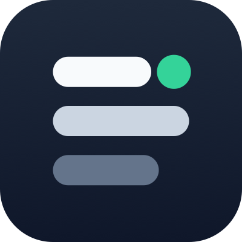

# OutageDeck MCP server

[](https://outagedeck.com/developers/mcp?utm_source=github&utm_medium=repository&utm_campaign=mcp_distribution)

[](https://glama.ai/mcp/connectors/com.outagedeck/outagedeck-status)

[](cursor://anysphere.cursor-deeplink/mcp/install?name=outagedeck&config=eyJ1cmwiOiJodHRwczovL291dGFnZWRlY2suY29tL2FwaS9tY3AifQ%3D%3D)
[](vscode:mcp/install?%7B%22name%22%3A%22outagedeck%22%2C%22type%22%3A%22http%22%2C%22url%22%3A%22https%3A%2F%2Foutagedeck.com%2Fapi%2Fmcp%22%7D)
[](https://aka.ms/awesome-copilot/install/agent?url=vscode%3Achat-agent%2Finstall%3Furl%3Dhttps%3A%2F%2Fraw.githubusercontent.com%2Fgithub%2Fawesome-copilot%2Fmain%2Fagents%2Fcloud-saas-outage-triage.agent.md)
[](https://awesome-copilot.github.com/agent/cloud-saas-outage-triage/)

[OutageDeck](https://outagedeck.com?utm_source=github&utm_medium=repository&utm_campaign=mcp_distribution) gives AI coding agents live status, incident timelines, and independent uptime history for 172 cloud and SaaS vendors. The remote server reads each vendor's official status feed and needs no API key for public status checks.

Use it to answer **“is it us or them?” before debugging your code**.

- Remote MCP endpoint: `https://outagedeck.com/api/mcp`
- Transport: Streamable HTTP
- Public status tools: free, no account or key
- Official MCP Registry: `com.outagedeck/outagedeck-status`
- Full documentation: [outagedeck.com/developers/mcp](https://outagedeck.com/developers/mcp?utm_source=github&utm_medium=repository&utm_campaign=mcp_distribution)
- Installable outage-triage agent: [published in GitHub Awesome Copilot](https://awesome-copilot.github.com/agent/cloud-saas-outage-triage/)
- GitHub Actions: [`outagedeck/status-check@v1`](https://github.com/outagedeck/status-check)
- Terminal and general CI: [`brew install outagedeck/tap/outagedeck`](https://github.com/outagedeck/cli)

## Connect in one line

Antigravity CLI (installs the native plugin with public read-only MCP tools):

```sh
agy plugin install https://github.com/outagedeck/mcp
```

The plugin uses Antigravity's current `serverUrl` schema, requests no secrets or local execution, and disables the five account-scoped tools. See the [Antigravity setup guide](https://outagedeck.com/developers/mcp?utm_source=github&utm_medium=repository&utm_campaign=antigravity_plugin) for prompts and the current public tool catalog.

Gemini CLI (installs the public read-only MCP tools as an extension):

```sh
gemini extensions install https://github.com/outagedeck/mcp
```

The extension requests no settings or secrets and intentionally exposes only the nine public read-only tools. See the [Gemini CLI setup guide](https://outagedeck.com/developers/mcp?utm_source=github&utm_medium=repository&utm_campaign=gemini_cli_extension) for prompts and the current tool catalog.

Codex (installs the MCP server plus the dependency-outage triage skill):

```sh
codex plugin marketplace add outagedeck/codex-plugins
```

Then run `/plugins`, choose **OutageDeck**, install the plugin, and start a new session. The [public plugin marketplace](https://github.com/outagedeck/codex-plugins) is validated against the live MCP contract.

Claude Code (installs the same MCP server and triage skill):

```sh
claude plugin marketplace add outagedeck/codex-plugins
claude plugin install outagedeck@outagedeck
```

Portable Agent Skill for Codex, Claude Code, Cursor, GitHub Copilot, Windsurf, Gemini CLI, Cline, and other compatible agents:

```sh
npx skills add https://github.com/outagedeck/codex-plugins --skill triage-dependency-outages
```

The portable skill is [listed with a passing Snyk audit on skills.sh](https://www.skills.sh/outagedeck/codex-plugins/triage-dependency-outages). It uses the MCP tools when available and otherwise falls back to the anonymous REST API for current status and incident evidence.

Agent Package Manager (after `apm init`; deploys to the clients declared in your APM project):

```sh
apm install --mcp com.outagedeck/outagedeck-status --transport http --registry https://registry.modelcontextprotocol.io
```

Claude Code, MCP connection only:

```sh
claude mcp add --transport http outagedeck https://outagedeck.com/api/mcp
```

OpenCode: add the remote server to `opencode.json`:

```json
{
  "$schema": "https://opencode.ai/config.json",
  "mcp": {
    "outagedeck": {
      "type": "remote",
      "url": "https://outagedeck.com/api/mcp"
    }
  }
}
```

Verify the connection with `opencode mcp debug outagedeck`, then ask: “Check AWS, GitHub, and Cloudflare for active incidents before changing deployment code. use outagedeck”. See the [OpenCode setup guide](https://outagedeck.com/developers/mcp?utm_source=github&utm_medium=repository&utm_campaign=opencode_mcp) for the current tool catalog and trust model.

For MCP clients that accept JSON configuration:

```json
{
  "mcpServers": {
    "outagedeck": {
      "url": "https://outagedeck.com/api/mcp"
    }
  }
}
```

No package, daemon, or environment variable is required.

## What an agent can do

Ask your agent:

- “Before debugging this deploy, check AWS, Cloudflare, GitHub, and OpenAI.”
- “Is Claude down, or is this failure in my app?”
- “What major vendor incidents are active right now?”
- “Show GitHub's uptime and incident history for the last 30 days.”
- “Give me a citable timeline for the current Cloudflare incident.”

Public tools:

| Tool | Purpose |
| --- | --- |
| `get_provider_status` | Live status for one provider |
| `check_my_stack` | One verdict across up to 12 providers |
| `list_active_incidents` | Active incidents across the catalog |
| `get_incident_details` | A vendor's complete incident update timeline |
| `get_uptime` | Independent 7–90 day uptime history |
| `get_outage_report` | Cross-vendor reliability summary |
| `search_providers` | Find providers by company or product name |
| `search` and `fetch` | Search and retrieve citable OutageDeck documents |

Account tools let subscribers manage their own custom providers and alerts without sharing webhook credentials in a conversation: `list_custom_providers`, `add_custom_provider`, `update_custom_provider`, `remove_custom_provider`, and `watch_provider`.

## Data and trust model

OutageDeck reads official provider status feeds about every 10 minutes. It does not guess from social reports or claim to replace a provider's own status page. Tool results include source and OutageDeck links so an agent can cite what it reports.

Public tools are read-only. Account-specific tools require an OutageDeck API key, and each tool declares its read-only, idempotent, and destructive hints to MCP clients.

## Availability and plans

Provider status, incident history, the public API, RSS, badges, and the public MCP tools are free without an account. Free accounts add email alerts for up to five providers. Paid plans add Slack, Teams, Discord, and webhook alerts, custom providers, and higher API quotas.

- [Create a free alert](https://outagedeck.com/account?utm_source=github&utm_medium=repository&utm_campaign=mcp_distribution)
- [See pricing](https://outagedeck.com/pricing?utm_source=github&utm_medium=repository&utm_campaign=mcp_distribution)
- [Browse all providers](https://outagedeck.com/providers?utm_source=github&utm_medium=repository&utm_campaign=mcp_distribution)

## Registry metadata

[`server.json`](server.json) mirrors the active record published to the official MCP Registry. This repository documents the hosted service; it does not contain the production server implementation. The MIT license applies to the documentation and registry metadata in this repository.

Questions or security reports: [hello@outagedeck.com](mailto:hello@outagedeck.com)
